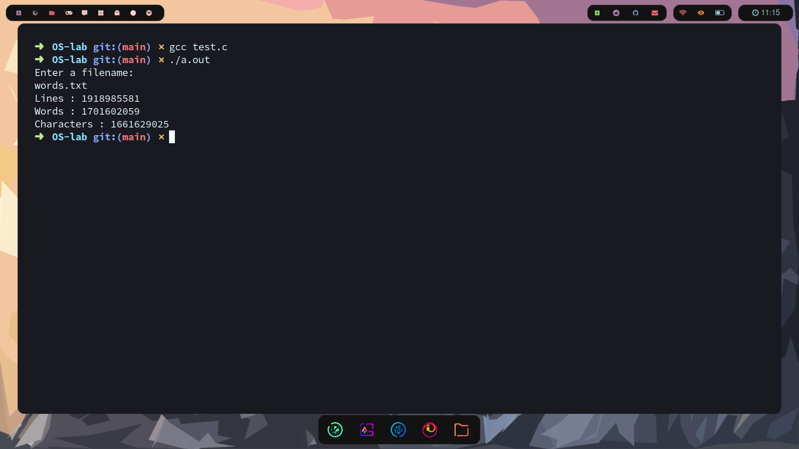

## C Program to count number of line, space and character in a file using system call
---
```C
#include <stdio.h>
#include <fcntl.h>
#include <stdlib.h>
#include <unistd.h>
int main()
{
    FILE *fp;
    char filename[100];
    char ch;
    int count = 1;
    int linecount, wordcount, charcount;
    linecount = 0;
    wordcount = 0;
    charcount = 0;
    printf("Enter a filename:\n");
    fgets(filename,100,stdin);
    fp = fopen("words.txt","r");
    int fd = open("words.txt",O_RDONLY);
    if (fd != -1)
    {
	   while ((ch=getc(fp)) != EOF) 
       {
            if (ch != ' ' && ch != '\n') 
            { 
                ++charcount; 
            }
            if (ch == ' ' || ch == '\n') 
            { 
                ++wordcount; 
            }
            if (ch == '\n') 
            { 
                ++linecount; 
            }
            count++;
            read(fd,&ch,count);
	   }
	   if (charcount > 0) 
       {
		++linecount;
		++wordcount;
	   }
    }
    else
    {
        printf("Failed to open the file\n");
    }
    printf("Lines : %d \n", linecount);
    printf("Words : %d \n", wordcount);
    printf("Characters : %d \n", charcount);
    return(0);
}
```
### Output:
