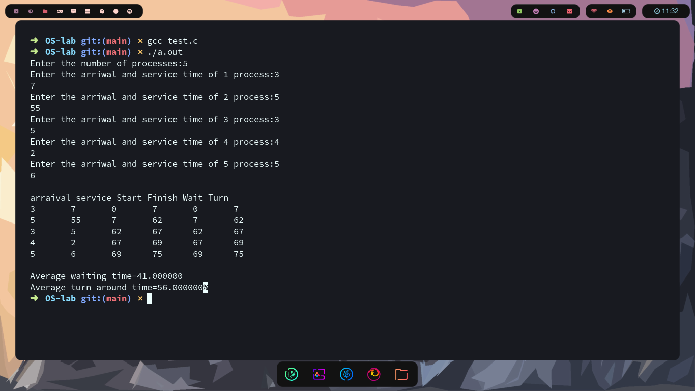

## C program for First come first serve scheduling algorithm and calculate average waiting time and turn around time
---
```C
#include<stdio.h>
int main()
{
    int n,i,j,sum=0;
    int arrv[10],ser[10],start[10];
    int finish[10],wait[10],turn[10];
    float avgturn=0.0,avgwait=0.0;
    start[0]=0;
    printf("Enter the number of processes:");
    scanf("%d",&n);
    for(i=0;i<n;i++)
    {
        printf("Enter the arriwal and service time of %d process:",i+1);
        scanf("%d%d",&arrv[i],&ser[i]);
    }
    for(i=0;i<n;i++)
    {
        sum=0;
        for(j=0;j<i;j++)
        sum=sum+ser[j];
        start[i]=sum;
    }
    for(i=0;i<n;i++)
    {
        finish[i]=ser[i]+start[i];
        wait[i]=start[i];
        turn[i]=ser[i]+wait[i];
    }
    for(i=0;i<n;i++)
    {
        avgwait+=wait[i];
        avgturn+=turn[i];
    }
    avgwait/=n;
    avgturn/=n;
    printf("\narraival service Start Finish Wait Turn\n");
    for(i=0;i<n;i++)
    printf("%d\t%d\t%d\t%d\t%d\t%d\n",arrv[i],ser[i],start[i],
    finish[i],wait[i],turn[i]);
    printf("\nAverage waiting time=%f",avgwait);
    printf("\nAverage turn around time=%f",avgturn);
    return 0;
}
```
## Output:
