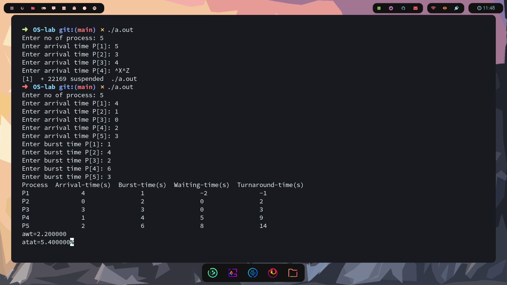

## C program for Non-preemptive SJF scheduling algorithm and calculate average waiting time and turn around time
---
```C
#include<stdio.h>
void main()
{
      int n,temp,tt=0,min,d,i,j;
      float atat=0,awt=0,stat=0,swt=0;
      printf("Enter no of process: ");
      scanf("%d",&n);
      int a[10],b[10],e[10],tat[10],wt[10];
      for(i=0;i<n;i++)
      {
        printf("Enter arrival time P[%d]: ",i+1);
        scanf("%d",&a[i]);
      }
      for(i=0;i<n;i++)
      {
        printf("Enter burst time P[%d]: ",i+1);
        scanf("%d",&b[i]);
      }
      for(i=0;i<n;i++)
      {
        for(j=i+1;j<n;j++)
        {
            if(b[i]>b[j])
            {
                temp=a[i];
                a[i]=a[j];
                a[j]=temp;
                temp=b[i];
                b[i]=b[j];
                b[j]=temp;
            }

        }
      }
      min=a[0];
      for(i=0;i<n;i++)
      {
        if(min>a[i])
        {
            min=a[i];
            d=i;
        }
      }
      tt=min;
      e[d]=tt+b[d];
      tt=e[d];
      for(i=0;i<n;i++)
      {
        if(a[i]!=min)
        {
         e[i]=b[i]+tt;
         tt=e[i];
        }
      }
      for(i=0;i<n;i++)
      {
        tat[i]=e[i]-a[i];
        stat=stat+tat[i];
        wt[i]=tat[i]-b[i];
        swt=swt+wt[i];
      }
      atat=stat/n;
      awt=swt/n;
      printf("Process  Arrival-time(s)  Burst-time(s)  Waiting-time(s)  Turnaround-time(s)\n");
    for(i=0;i<n;i++)
    {
    printf("P%d\t\t%d\t\t%d\t\t%d\t\t%d\n",i+1,a[i],b[i],wt[i],tat[i]);
    }
    printf("awt=%f\natat=%f",awt,atat);
}
```
### Output:
