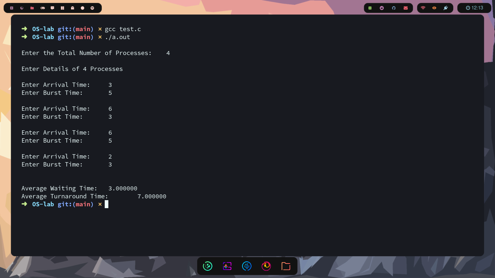

## C program for preemptive SJF scheduling algorithm and calculate average waiting time and turn around time
---
```C
#include <stdio.h>
int main() 
{
      int arrival_time[10], burst_time[10], temp[10];
      int i, smallest, count = 0, time, limit;
      double wait_time = 0, turnaround_time = 0, end;
      float average_waiting_time, average_turnaround_time;
      printf("\nEnter the Total Number of Processes:\t");
      scanf("%d", &limit); 
      printf("\nEnter Details of %d Processes\n", limit);
      for(i = 0; i < limit; i++)
      {
            printf("\nEnter Arrival Time:\t");
            scanf("%d", &arrival_time[i]);
            printf("Enter Burst Time:\t");
            scanf("%d", &burst_time[i]); 
            temp[i] = burst_time[i];
      }
      burst_time[9] = 9999;  
      for(time = 0; count != limit; time++)
      {
            smallest = 9;
            for(i = 0; i < limit; i++)
            {
                  if(arrival_time[i] <= time && burst_time[i] < burst_time[smallest] && burst_time[i] > 0)
                  {
                        smallest = i;
                  }
            }
            burst_time[smallest]--;
            if(burst_time[smallest] == 0)
            {
                count++;
                end = time + 1;
                wait_time = wait_time + end - arrival_time[smallest] - temp[smallest];
                turnaround_time = turnaround_time + end - arrival_time[smallest];
            }
      }
      average_waiting_time = wait_time / limit; 
      average_turnaround_time = turnaround_time / limit;
      printf("\n\nAverage Waiting Time:\t%lf\n", average_waiting_time);
      printf("Average Turnaround Time:\t%lf\n", average_turnaround_time);
      return 0;
}
```
## Output:
