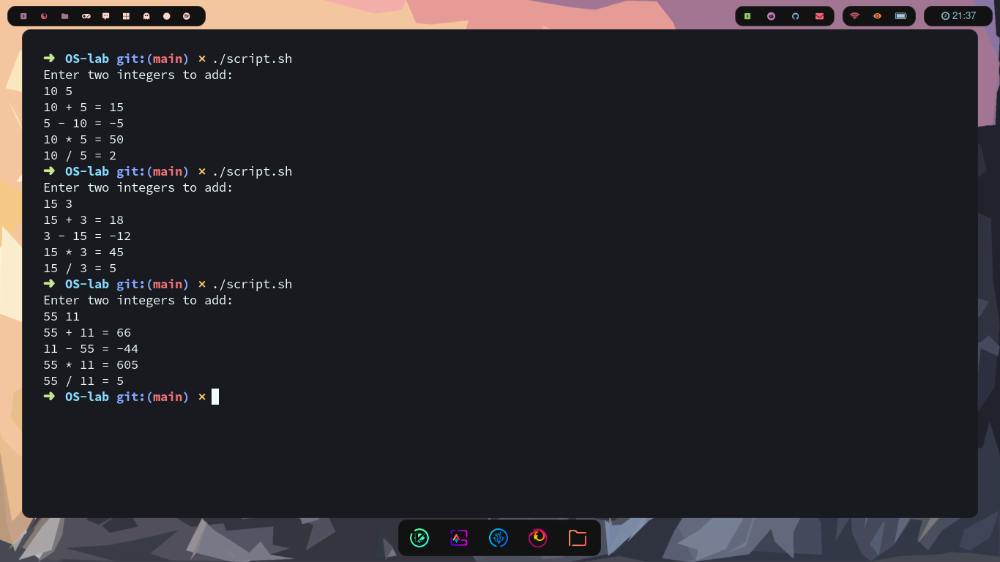

##Shell script to perform arithmetic operations
---
```bash
#!/bin/bash

#Addition
echo "Enter two integers to add:"
read a b
result=$(echo "$a + $b")
echo "$a + $b = $result"

# #Subtraction
result=$(echo "$b - $a" | bc -l)
echo "$b - $a = $result"

#Multiplication
result=$(echo "$a * $b")
echo "$a * $b = $result"

# #Division
result=$(echo "$a / $b")
# -l option loads the standard math lib with scale set to 20 as default
echo "$a / $b = $result"
```
##Output
