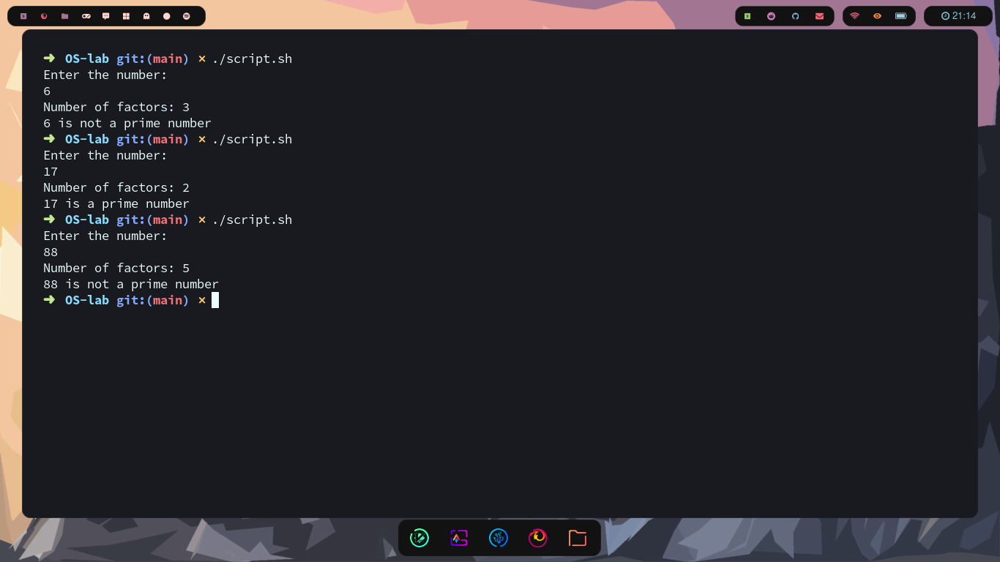

##Shell script to check for prime number
---
```bash
#!/bin/bash

echo "Enter the number:"
read num
if [ $num -eq 1 ]
then
    echo "$num is neither prime nor composite number"
    exit 0;
fi
factors=`factor $num|wc -w`
echo "Number of factors: $factors"

if [ $factors -eq 2 ]
then
    echo "$num is a prime number"
else
    echo "$num is not a prime number"
fi
```
